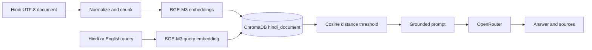

# Hindi Agriculture RAG Assistant

Production-oriented Hindi document question answering with multilingual embeddings, persistent ChromaDB retrieval, and grounded OpenRouter generation.

## Overview

The application accepts Hindi, English, and mixed Hindi-English questions over the sole knowledge source, `data/raw/hindi_document.txt`. It uses `BAAI/bge-m3` for both document and query embeddings, ChromaDB cosine-distance search, and an OpenAI-compatible OpenRouter client.

Unsupported questions are refused when no context passes retrieval. The prompt also requires the LLM to use only supplied context, answer in English, and never use outside knowledge.

## Architecture



## Stack

Python 3.11+, Streamlit, ChromaDB, Sentence Transformers, `BAAI/bge-m3`, OpenRouter, OpenAI-compatible SDK, python-dotenv, pydantic-settings, and pytest.

## Configuration

Copy `.env.example` to `.env` and provide the API key locally:

```env
LLM_PROVIDER=openrouter
LLM_MODEL=openrouter/free
OPENROUTER_API_KEY=
OPENROUTER_BASE_URL=https://openrouter.ai/api/v1
OPENROUTER_FALLBACK_MODELS=
EMBEDDING_MODEL=BAAI/bge-m3
CHROMA_PERSIST_DIRECTORY=chroma_db
CHROMA_COLLECTION_NAME=hindi_document
TOP_K=4
RELEVANCE_THRESHOLD=0.25
CHUNK_SIZE=400
CHUNK_OVERLAP=60
```

`.env` is ignored by Git. Never commit, print, or paste API keys. Rotate any credential that has been exposed outside the local environment.

## Ingestion

```powershell
python ingest.py
```

Ingestion validates that the source exists, is non-empty UTF-8, and contains the expected agriculture vocabulary. It preserves Devanagari, creates sentence-preserving overlapping chunks, embeds with BGE-M3, rebuilds the `hindi_document` collection under `chroma_db`, and verifies the final count. The chunk count is calculated from the configured size and overlap.

## Design decisions

### Chunking strategy

The loader normalizes Unicode to NFC while preserving Devanagari. The chunker
keeps section and paragraph content together, splits at Hindi or English
sentence boundaries, and adds small sentence overlap. This preserves the
relationship between a topic such as wheat soil and its explanation while
creating multiple stable chunks.

### Vector database

ChromaDB is an open-source, lightweight vector database with persistent local
storage, cosine-distance search, and a simple Python API. It fits this
single-document MVP without requiring a separate service.

### Hindi text, tokenization, and embeddings

Source and generated artifacts use UTF-8 with Hindi text intact; Hindi is never
translated before embedding. Sentence Transformers performs tokenization, and
`BAAI/bge-m3` provides multilingual embeddings for Hindi, English, and mixed
queries. Document and query vectors are normalized before cosine search.

## Run the application

```powershell
streamlit run app.py
```

The UI reports document, embedding, vector-store, and provider status. It shows answers, similarity scores, source sections, chunk IDs, metadata, and expandable retrieved text without exposing secrets. An empty knowledge base gives a clear instruction to run ingestion.

## Retrieval

ChromaDB is configured with cosine distance. Lower distance is more relevant, so results expose both the raw distance and:

```text
similarity = max(0, 1 - cosine_distance)
```

The threshold is a configurable small-corpus heuristic. Evaluation measures whether retrieved context contains labeled evidence terms; it does not claim that retrieval metrics prove generated-answer correctness.

## Example questions and no-answer behavior

The system accepts questions such as:

```text
गेहूं की खेती के लिए कौन सी मिट्टी उपयुक्त है?
What type of soil is suitable for wheat?
गेहूं के लिए suitable soil कौन सी है?
```

Answers are generated in English using only retrieved context. If the document
does not contain sufficient information, it returns:

```text
The provided document does not contain sufficient information to answer this question.
```

## Evaluation

The 15-question set in `evaluation/questions.json` contains ten answerable agriculture questions and five deliberately unanswerable questions. Run:

```powershell
python evaluation/evaluate_retrieval.py
python evaluation/evaluate_answers.py
```

The evaluator reports answerable evidence-term hits and unsupported-question retrieval behavior. No live paid API call is required for the test suite.

## Tests

```powershell
python -m pytest
```

Tests cover configuration, UTF-8 loading, sentence-aware Hindi chunking, overlap and metadata, embedding adaptation, retrieval orchestration, grounded pipeline behavior, OpenRouter configuration, fallback request construction, and provider error handling.

## Project structure

```text
data/raw/hindi_document.txt       # sole source document
data/processed/chunks.json        # generated UTF-8 chunk artifact
src/config.py                     # environment-backed settings
src/document_loader.py            # UTF-8 loading and normalization
src/text_processor.py             # sentence/paragraph chunking
src/embeddings.py                 # BAAI/bge-m3 adapter
src/vector_store.py               # persistent Chroma wrapper
src/retriever.py                  # retrieval orchestration
src/llm.py                        # provider abstraction and OpenRouter
src/prompts.py                    # grounded prompt
src/rag_pipeline.py               # retrieval-to-answer flow
ingest.py                         # rebuild and validate index
app.py                            # Streamlit interface
evaluation/                       # labeled retrieval evaluation
tests/                            # deterministic pytest suite
```

## Limitations

Similarity thresholds need calibration on a larger labeled corpus. Local BGE-M3 inference can be slow on a cold start. Generated-answer correctness and groundedness require human or optional external evaluation. The current app indexes one local document and has no document access-control layer.

With more time, the project could add a larger labeled evaluation set,
reranking for larger collections, document versioning, and automated answer
groundedness checks.
